# Лабораторная работа №1 по предмету SMAI.
## Тема: Основы Linux
### Выполнено студентом: Бритков Егор, I2402
### Цель: 
Изучить основы операционной системы Linux, включая структуру файловой системы, базовые
команды для работы с ней, создание и управление пользователями, а также основы управления
процессами и правами доступа.

### Раздел 1: Структура файловой системы
#### Теория:
Файловая система Linux представляет собой иерархическую структуру, где все файлы и каталоги
организованы в едином дереве. Корневая директория обозначается как /. Все остальные файлы
и каталоги расположены внутри нее.


-  `/` — корневая директория, от которой начинается вся структура.
-  `/bin` — бинарные исполнимые файлы (основные утилиты, доступные для всех
пользователей).
- `/etc` — системные конфигурационные файлы.
- `/home` — домашние директории пользователей.
- `/lib` — библиотеки, необходимые для работы программ.
- `/tmp` — временные файлы.
- `/var` — файлы, изменяющиеся во время работы системы (логи, базы данных и т.д.).
- `/usr` — утилиты и программы, установленные для использования пользователями.
- `/dev` — устройства, доступные в системе.

#### Практика

1. Используя команду ls, просмотреть содержимое корневой директории `/`.

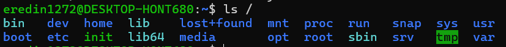 


2. Ознакомиться с содержимым других системных директорий с помощью ls /директория.

Примеры:

```bash
ls /home
```

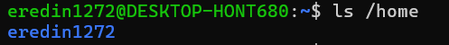 

*(`/home` - домашний каталог пользователя)*

```bash
ls /etc
```

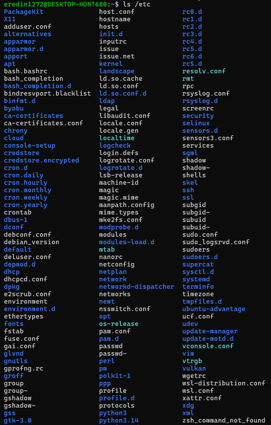 

*(`/etc` - каталог системных конфигурационных файлов)*

```bash
ls /tmp
```

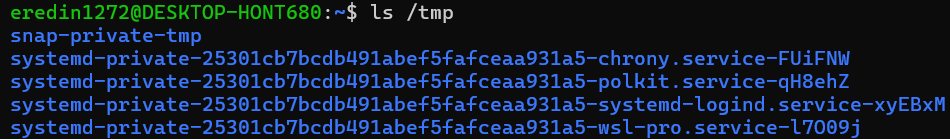

*(`/tmp` - каталог Linux предназначеный для времменных файлов)*

3. Использовать команду `tree` для визуализации структуры каталогов.

``` bash
eredin1272@DESKTOP-HONT680:~$ sudo apt install tree
```
``` bash
eredin1272@DESKTOP-HONT680:~$ sudo apt install tree
```
```bash
eredin1272@DESKTOP-HONT680:~$ tree -L 2 /
```
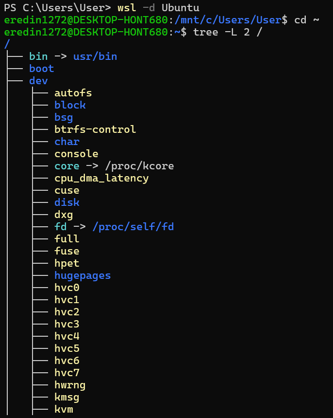
---
### Раздел 2: Базовые команды Linux

#### Теория
Основные команды для работы с файловой системой:
- ls — выводит список файлов и каталогов в текущей директории.
- cd — смена текущей директории.
- pwd — выводит путь к текущей директории.
- cp — копирование файлов и каталогов.
- mv — перемещение или переименование файлов.
- rm — удаление файлов и каталогов.
- mkdir — создание каталога.
- rmdir — удаление пустого каталога.

#### Практика
1. Создать каталог с помощью mkdir.

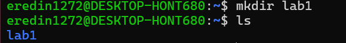

2. Переместите в него файл с помощью mv.

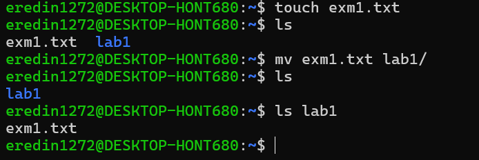

4. Скопировать файл с помощью cp
   
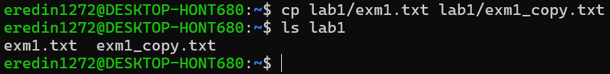

6. Удалить файл и каталог с помощью rm и rmdir

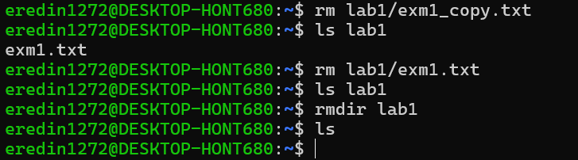

### Раздел 3: Управление пользователя и правами
#### Теория

Каждый файл и каталог в Linux имеет три типа прав доступа:
- r — право на чтение.
- w — право на запись.
- x — право на выполнение.
Права могут быть назначены владельцу файла, группе и всем остальным пользователям.
Команды для управления пользователями:
- useradd — создание нового пользователя.
- passwd — изменение пароля пользователя.
- usermod — изменение свойств пользователя.
- groupadd — создание новой группы.
Команды для работы с правами доступа:
- chmod — изменение прав доступа.
- chown — изменение владельца и группы файла.
- chgrp — изменение группы файла.

#### Практика
1. Создать нового пользователя с помощью useradd и установить для него пароль с помощью passwd.

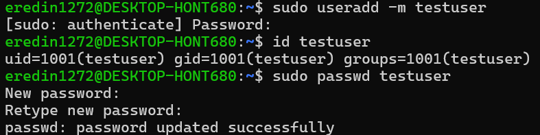

2. Ознакомиться с текущими правами доступа к файлам с помощью команды ls -l.

проверяем текущие права

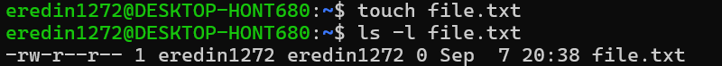


3. Изменить права доступа с помощью chmod и проверить результат

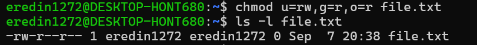

теперь владелец может читать и записывать, группа только читать, остальные только читать.

4. Изменить владельца файла с помощью chown
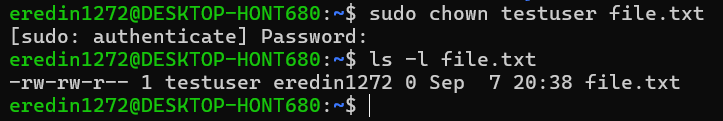

### Раздел 4: Процессы в Linux
#### Теория
В Linux каждый запущенный процесс имеет уникальный идентификатор — PID. Система
позволяет управлять процессами с помощью различных команд.
Основные команды для работы с процессами:
- ps — отображение списка текущих процессов.
- top — отображение динамического списка процессов с подробной информацией.
- kill — завершение процесса по PID.
- bg и fg — запуск процесса в фоне и возвращение в передний план.

#### Практика

1. Ознакомиться с процессами с помощью `ps aux`.

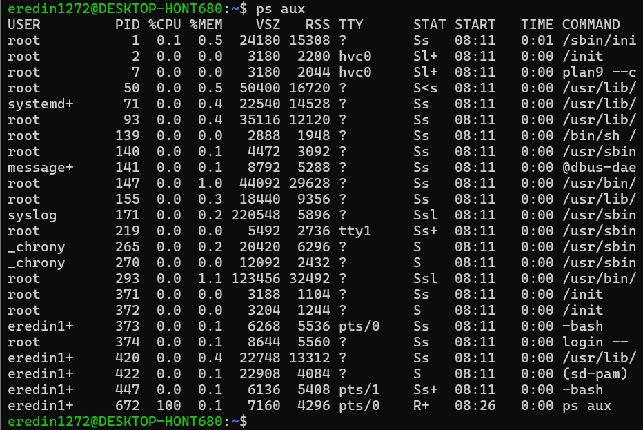

- USER — пользователь, которому принадлежит процесс;
- PID — уникальный идентификатор процесса;
- %CPU — использование процессора;
- %MEM — использование памяти;
- COMMAND — какая программа запущена.

2. Использовать команду top для отображения списка процессов.
   
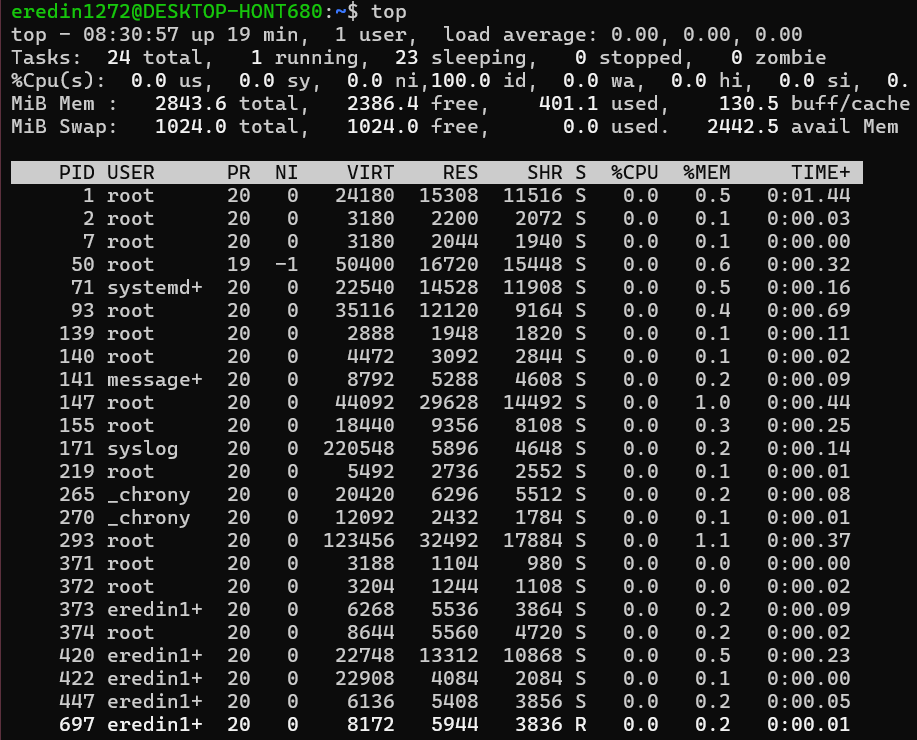

Команда top используется для мониторинга процессов в реальном времени. Она отображает PID процессов, пользователя, загрузку CPU и памяти, а также другую информацию о состоянии системы. В отличие от ps, команда top постоянно обновляет информацию.

3. Завершить проуесс с помощью `kill`
   
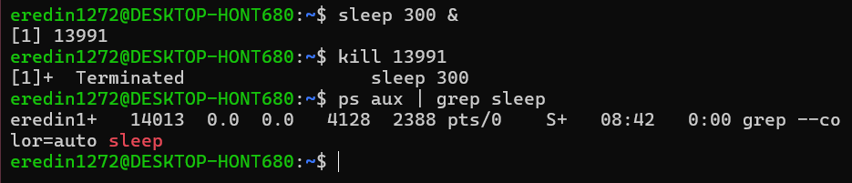

- sleep 300 — процесс, который просто спит 300 секунд;
- & — запускает его в фоне;

[1] 13991 - эти 5 цифр это PID

### Раздел 5: Обработка текста с помощью grep, sed и awk
#### Теория
Теоретическая часть:
- grep — Поиск текста в файлах
- grep — это команда, которая используется для поиска строк, содержащих заданный текст (или
регулярное выражение) в одном или нескольких файлах.
Основные синтаксисы:
- grep <шаблон> <файл> — поиск строк, содержащих шаблон.
- grep -r <шаблон> <директория> — рекурсивный поиск по всей директории.
- grep -i <шаблон> <файл> — поиск без учета регистра.
- grep -v <шаблон> <файл> — вывод строк, которые не содержат шаблон.


#### Практика
1. **grep**
- Используйте команду grep для поиска определенных строк в системных
журналах, например, в файле /var/log/syslog

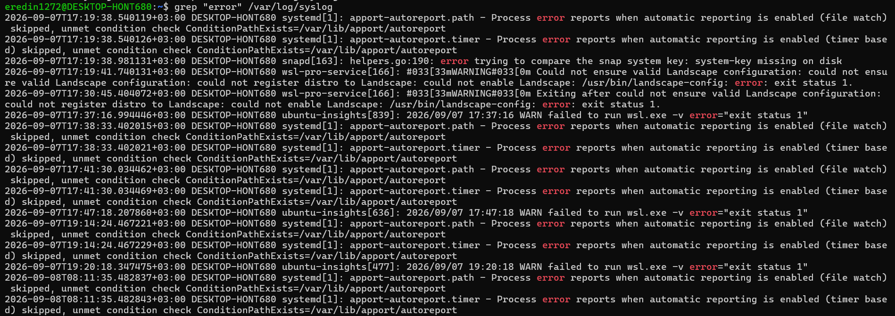

- Выполните поиск всех строк, содержащих ошибку error или предупреждение
warning.

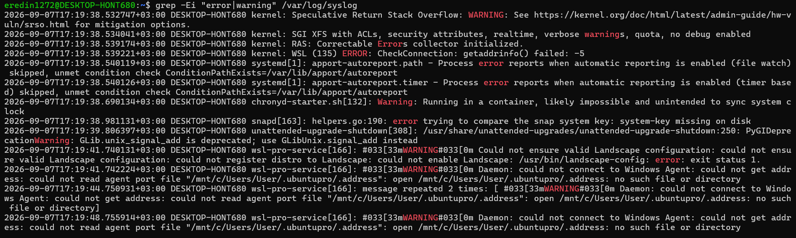

- E — позволяет использовать условие error|warning;
- i — игнорирует регистр

- Найдите все строки, не содержащие слово debug

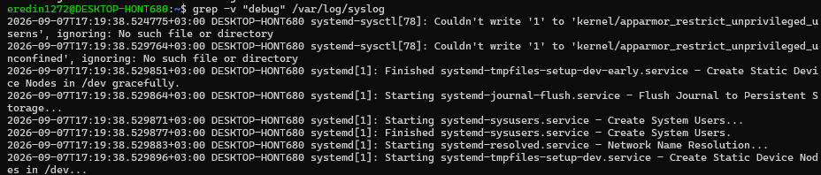

2. **sed**
- Замените все вхождения слова Linux на Unix в тексте.
- Используя sed, удалите все пустые строки из файла (замените их на что-то другое
или просто удалите).
- Сделайте замену в файле с помощью опции -i, чтобы изменения были применены
непосредственно в файле

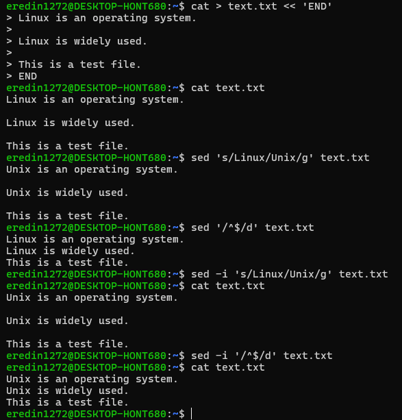

Здесь мы создаем тестовый  файл и предварительно меняем все "Linux" на "Unix".

- s - substitute, заменить
- g - заменить все вхождения в строке
- i - изменение файла

3. **awk**
- Используйте команду awk, чтобы вывести второй и третий столбцы из файла с данными, разделенными пробелами или табуляциями.
- Примените команду awk для выборки строк, где значение в одном из столбцов
больше заданного числа.

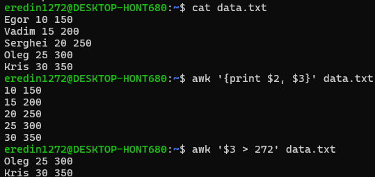

- Используя awk, обработайте файл CSV и выведите только те строки, которые соответствуют определенному условию.

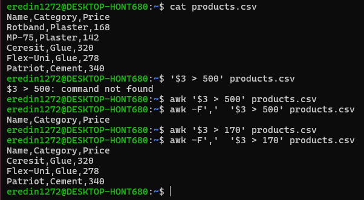

### Заключение
В ходе выполнения лабораторной работы я получил практический опыт работы с операционной системой Linux. Наиболее полезным для меня было повторение основных команд терминала, работы с файлами и каталогами, пользователями и правами доступа. Также было интересно вспомнить управление процессами с помощью команд `ps`, `top` и `kill`, а также  обработку текста при помощи `grep`, `sed` и `awk`.

Практическая работа с командами помогла лучше понять структуру Linux и принципы взаимодействия с операционной системой через терминал. Особенно полезным было самостоятельно выполнять команды и сразу видеть их результат.

