# Лабораторная работа №2 по предмету SMAI.
## Тема: Основы сетей
### Выполнено студентом: Бритков Егор, I2402
### Цель: 
Освоить базовые сетевые команды и инструменты диагностики в Linux. Научиться
анализировать сетевые подключения и маршруты, а также проверять доступность удалённых
ресурсов.

### Теоретическое введение:
- IP-адрес и маска сети.
- MAC-адрес.
- Маршрутизация: таблица маршрутов.
- DNS: преобразование имён в IP-адреса.
- Утилиты: ip, ping, traceroute, ss, netstat, dig, curl, nc.

### Практические задания
#### Часть 1: Базовая диагностика
1. Определите IP-адреса и MAC-адреса всех сетевых интерфейсов вашей машины

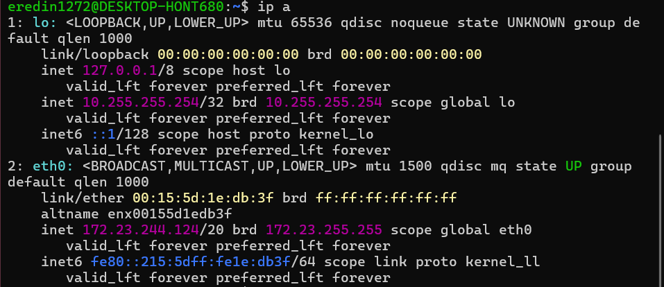

- Интерфейс `lo`:
    - IP: `127.0.0.1`
    - MAC: `00:00:00:00:00:00`
- Интерфейс `eth0`:
    - IP: `172.23.244.124/20`
    - MAC: `00:15:5d:1e:db:3f`

2. Выведите таблицу маршрутизации.

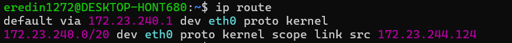

3. Проверьте доступность узла 8.8.8.8 и сайта google.com с помощью ping.

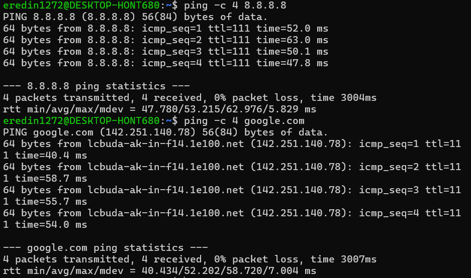


4. Сравните результаты: что произойдёт, если DNS не работает?

При отключении DNS проверка узла по IP-адресу (8.8.8.8) продолжит работать, поскольку IP-адрес уже известен. При обращении к google.com имя не сможет быть преобразовано в IP-адрес, поэтому ping завершится ошибкой разрешения имени.

#### Часть 2: Маршруты и трассировка

1. Выполните трассировку (traceroute) до google.com.

```bash
sudo apt update
sudo apt install traceroute
```

Команда `traceroute google.com` показывает, через какие промежуточные маршрутизаторы проходит пакет от твоей Ubuntu WSL до Google.

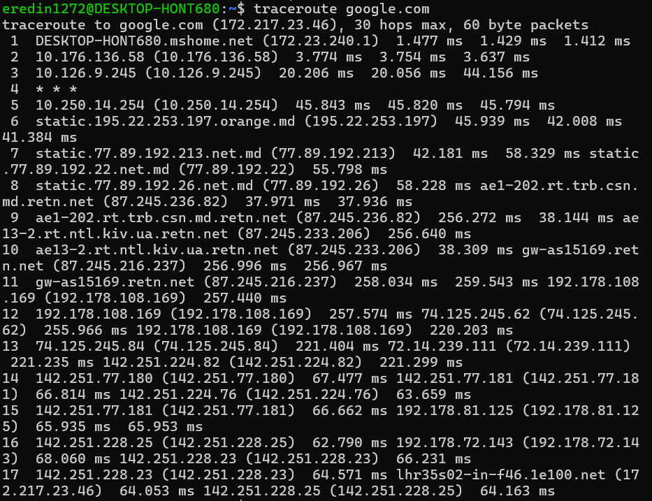

2. Сохраните список промежуточных узлов.


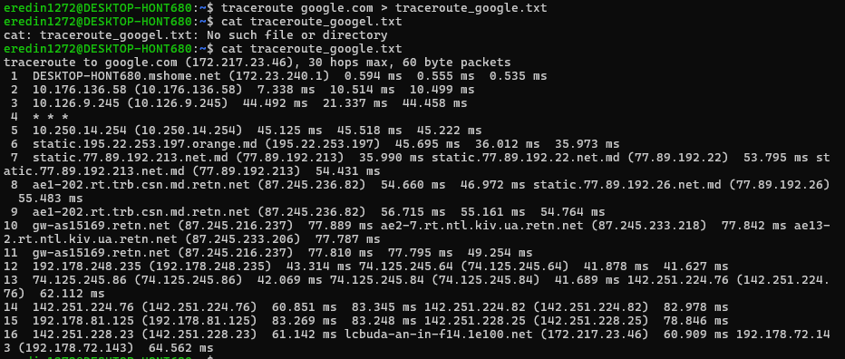

3. Попробуйте трассировку до локального сервера в вашей сети (если есть).


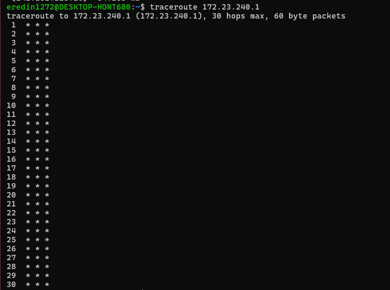
 
 При попытке трассировки до локального шлюза 172.23.240.1 ответы от узла не были получены: на всех 30 переходах отображалось * * *. Это связано с тем, что виртуальный сетевой шлюз WSL2 может не отвечать на запросы traceroute. При этом сетевое соединение работает нормально.

#### Часть 3: Порты и соединения

1. Определите, какие порты слушает ваша система:

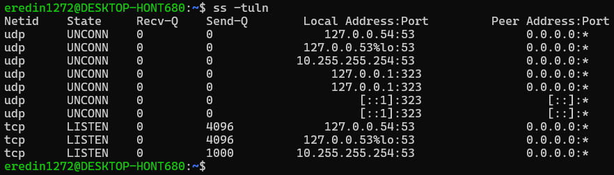

- t — TCP
- u — UDP
- l — только слушающие порты (listening)

2. Запустите локальный сервер для теста:
- nc -l 12345
- и подключитесь к нему с другой вкладки терминала (nc localhost 12345).

```bash
nc -l 12345
```

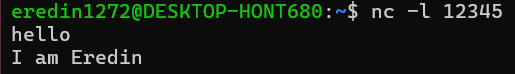


Далее подключаемся, со второй вкладки, устанавливаем соединение

```bash
nc localhost 12345
```

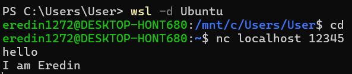

В третьей вкладке выполняем 

```bash
ss -tuln
```

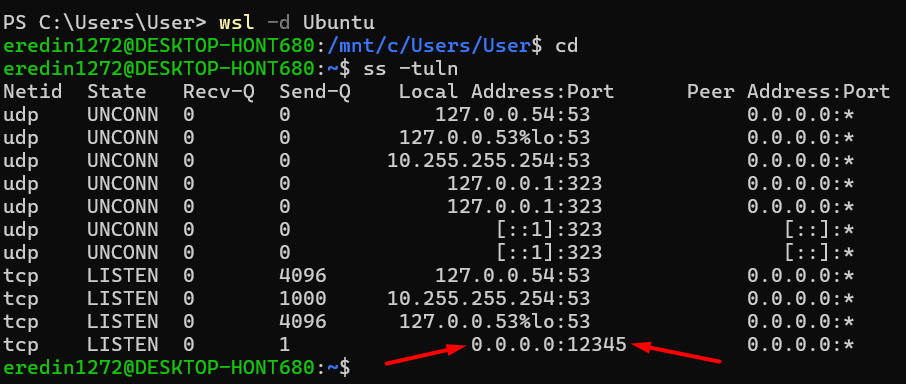

С помощью `nc -l 12345` был запущен локальный TCP-сервер, ожидающий подключения на порту 12345. С помощью команды `nc localhost 12345` было установлено соединение с сервером. Передача текста между двумя терминалами подтвердила успешное установление соединения.

#### Часть 4: Работа с DNS

1. Используйте команду dig для запроса IP-адреса домена google.com.

Сначала устанавливаем dig:

```bash
sudo apt update
sudo apt instal dnsutils
```

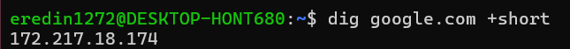

`+short` - используем для короткой формы ответа


2. Определите, какой DNS-сервер используется вашей системой.

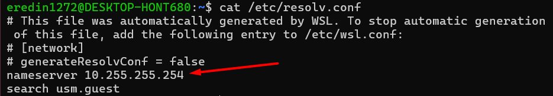

Это DNS-сервер, который настроен для этой WSL-системы

3. Попробуйте запросить MX-записи для домена gmail.com.

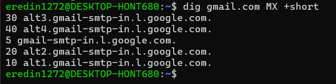

Число перед сервером — это приоритет MX-записи: чем меньше число, тем выше приоритет.

С помощью утилиты dig был выполнен DNS-запрос для определения IP-адреса домена google.com. DNS-сервер системы был определён через файл /etc/resolv.conf и поле SERVER в выводе dig. Для домена gmail.com были получены MX-записи, определяющие почтовые серверы и их приоритеты.

#### Часть 5: Мини-проект «Сетевой отчёт»

Каждый студент выбирает один сайт (например, github.com) и готовит:

1. IP-адреса и DNS-записи сайта.

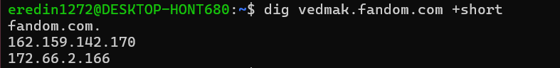

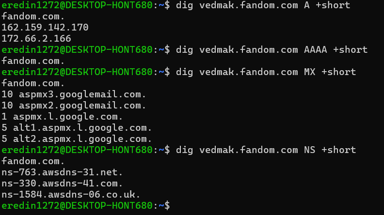

DNS-записи содержат различную информацию о домене. A-запись определяет IPv4-адрес, AAAA — IPv6-адрес, MX указывает почтовые серверы, а NS определяет DNS-серверы, обслуживающие домен.

2. Трассировку до сервера.

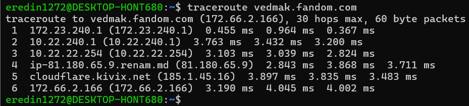

Это покажет последовательность маршрутизаторов (hop'ов) от компьютера до сервера.

3. Список открытых портов.

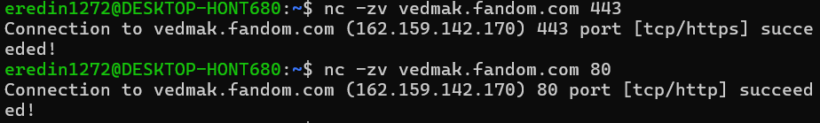


4. Заголовки HTTP-ответа.

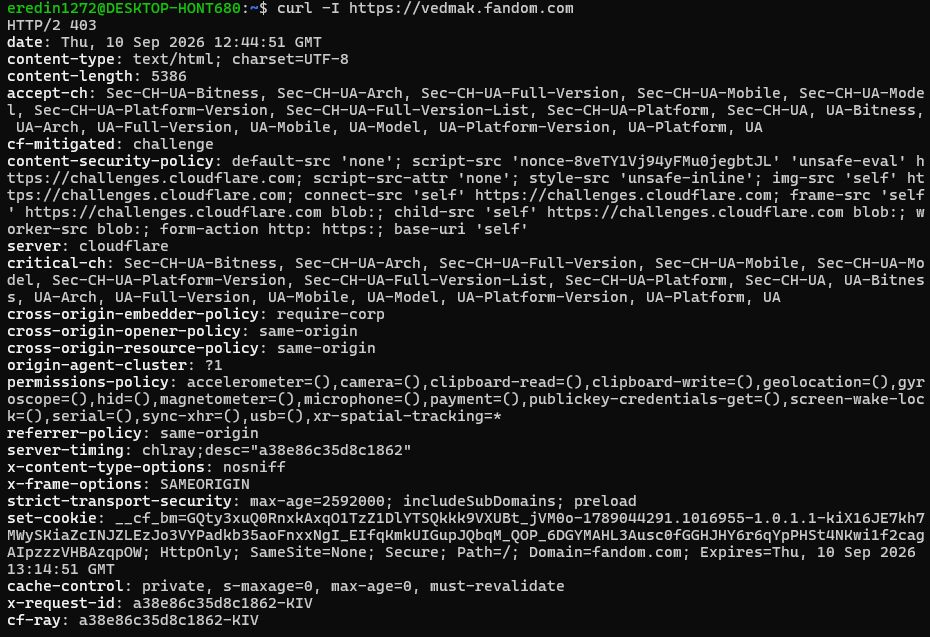

При выполнении команды `curl -I https://vedmak.fandom.com` сервер вернул ответ `HTTP/2 403 Forbidden`. Это означает, что запрос был получен сервером, но доступ к ресурсу был отклонён. В заголовках указано, что запрос обрабатывается Cloudflare (`server: cloudflare`), а `cf-mitigated: challenge` показывает применение защитной проверки. Также были получены заголовки безопасности, включая `strict-transport-security`, `x-frame-options` и `x-content-type-options`.


5. SSL-сертификат (действителен ли?).

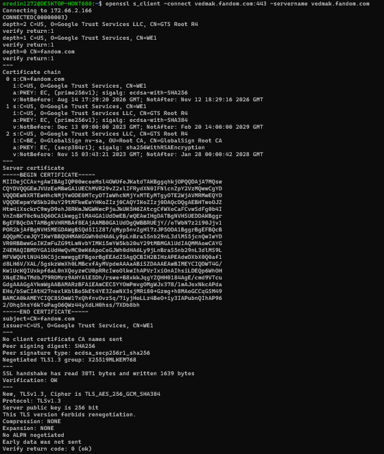

```bash
Verify return code: 0 (ok)
```

Это означает, что сертификат успешно прошёл проверку доверия.

### Заключение
В ходе лабораторной работы были изучены основные сетевые возможности операционной системы Linux. Были исследованы прослушиваемые порты и установлено локальное TCP-соединение с помощью утилиты `nc`. С помощью команды `dig` были выполнены DNS-запросы для определения IP-адресов и различных DNS-записей доменов.

Также был проведён анализ сетевого взаимодействия с сайтом `github.com`: выполнена трассировка маршрута, проверены доступность основных портов, получены HTTP-заголовки и исследован SSL-сертификат. В результате были получены практические навыки работы с сетевыми утилитами Linux и понимание принципов DNS, TCP-соединений, HTTP/HTTPS и SSL.

